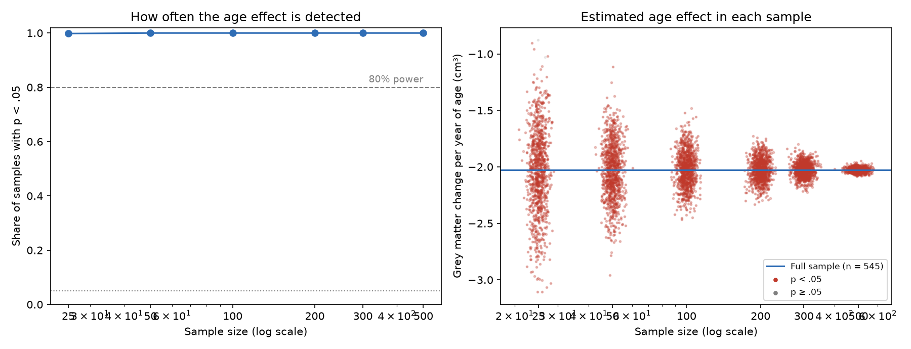

# Brain Changes Across the Lifespan: Estimating Age from MRI

How do brain volumes change from age 20 to 86, and can a machine-learning model predict how old a brain is? A reproducible structural MRI pipeline on 563 open-access scans from three London hospitals.

**Status:** pre-registered analysis complete (8 October 2026). H1–H5 supported, H6 not supported, H7 technically met but uninformative (hypotheses and abbreviations are defined in [Key terms](#key-terms); details in [Results](#results)). The analysis plan was pre-registered in [PREREGISTRATION.md](PREREGISTRATION.md) before any models were run.

## Key terms

**The seven hypotheses** (written down in [PREREGISTRATION.md](PREREGISTRATION.md) before any analysis)

| | Prediction |
| --- | --- |
| H1 | Grey matter volume declines with age |
| H2 | White matter volume rises into midlife, then declines |
| H3 | Cerebrospinal fluid (CSF) volume rises with age, faster after 60 |
| H4 | Hippocampus and thalamus volumes decline with age, faster after 60 |
| H5 | A brain age model predicts age better than guessing everyone's mean age |
| H6 | The brain age model is less accurate on a hospital it wasn't trained on |
| H7 | Small studies detect the grey matter–age effect less often and overestimate it when they do (the "winner's curse") |

**Brain anatomy**

| Term | Meaning |
| --- | --- |
| Grey matter | Brain tissue made mostly of nerve cell bodies, where information is processed |
| White matter | Bundles of nerve fibres that carry signals between brain regions |
| Cerebrospinal fluid (CSF) | Fluid in and around the brain; its volume grows as brain tissue shrinks |
| Subcortical structures | Groups of grey matter deep inside the brain: thalamus (relays sensory signals), caudate, putamen and pallidum (movement and habits), accumbens (reward), hippocampus (memory), amygdala (emotion) and brainstem (connects brain and spinal cord). L and R = left and right |
| Intracranial volume (ICV) | Total volume inside the skull; used to adjust for head size |
| Atrophy | Shrinkage of brain tissue |

**Scans and processing**

| Term | Meaning |
| --- | --- |
| MRI | Magnetic resonance imaging: a scanner that uses magnetic fields to image the body without radiation |
| T1 scan (T1-weighted) | A type of MRI scan that shows grey matter, white matter and fluid with good contrast, used to measure brain structure |
| IXI | Information eXtraction from Images: the open-access dataset of about 600 healthy adults' scans used here, from Guy's Hospital (Guy's), Hammersmith Hospital (HH) and the Institute of Psychiatry (IOP) in London |
| Site | The hospital where a scan was taken; each used a different scanner |
| FSL | FMRIB Software Library: free, widely used software for analysing brain scans |
| BET | Brain Extraction Tool (FSL): removes the skull and scalp from the image |
| FAST | FMRIB's Automated Segmentation Tool (FSL): labels each voxel as grey matter, white matter or CSF |
| FIRST | FMRIB's Integrated Registration and Segmentation Tool (FSL): outlines the 15 subcortical structures |
| SIENAX | Structural Image Evaluation using Normalisation of Atrophy, cross-sectional (FSL): estimates head size |
| Voxel | A 3D pixel, the smallest unit of a brain image |
| cm³ | Cubic centimetres (= millilitres), the unit for volumes |

**Quality control**

| Term | Meaning |
| --- | --- |
| QC | Quality control: checking each scan's processing for errors before analysis |
| Visual rating (0 / 1 / 2) | Each scan's outlines were rated good (0), minor issue (1, kept) or failure (2, excluded) |
| Blind rating | Scans were rated under random codes, so age, sex and hospital couldn't influence the rating |
| Test–retest | 50 scans were rated a second time to check that ratings are consistent |
| Cohen's kappa | A measure of rating agreement that corrects for agreement by chance (0 = chance, 1 = perfect) |
| CNR / SNR | Contrast-to-noise and signal-to-noise ratios: measures of image quality (higher = clearer) |
| Robust z-score | How unusual a value is compared with the others, measured in a way that isn't thrown off by extreme values (MAD = median absolute deviation) |

**Study design and statistics**

| Term | Meaning |
| --- | --- |
| Pre-registration | Writing down the hypotheses and analysis plan before seeing the results, so they can't be changed to fit the data |
| Deviation | A change from the pre-registered plan, reported with its reason |
| Blind analysis / shuffled data | All code was written and tested on a copy of the data with age, sex and hospital shuffled between people, so no real result could steer it |
| Unblinding | Linking the QC ratings to the real data once all rating was finished |
| Sensitivity analysis | Repeating an analysis with a different reasonable choice (for example, stricter QC) to check the result doesn't depend on it |
| ComBat | A statistical method that removes differences between scanners while keeping real effects such as age |
| GAM | Generalized additive model: a regression that fits smooth curves instead of straight lines, used for the lifespan curves (R package mgcv) |
| p-value; FDR | The chance of a result at least this strong if there were no real effect; FDR (false discovery rate) correction adjusts p-values when many structures are tested at once |
| Brain age | The age a model predicts from someone's brain volumes; the brain age gap is predicted minus real age |
| Ridge regression, random forest, gradient boosting | Three machine-learning model types used to predict age (Python package scikit-learn) |
| Baseline | A "model" that guesses the average age for everyone; a real model must beat it |
| MAE | Mean absolute error: the average size of a prediction's error, in years |
| Nested cross-validation | Repeatedly training on part of the data and testing on the rest, with model settings tuned only on training data, so the test scores are honest |
| Leave-one-site-out | Training on two hospitals and testing on the third, to check the model works on an unseen scanner |
| Bias correction | A standard adjustment for brain age models' tendency to overestimate young people's age and underestimate older people's |
| Detection rate | The share of simulated studies that find an effect (p < .05); also called statistical power |
| Winner's curse | Small studies that do find an effect tend to overestimate its size |

## Key findings

- **Brains shrink steadily from 20 to 86.** Grey matter falls by about 20 cm³ (3.5%) per decade. White matter peaks in the late 30s and then declines, and the fluid-filled spaces grow twice as fast after 60. The **hippocampus**, central to memory, is stable until about 60 and then loses about 8% per decade.
- **A machine-learning model can estimate age from 18 brain volumes to within 7.4 years on average**, half the error of guessing the mean age, and it worked as well on hospitals it had never seen as on its own.
- **Small studies mislead.** With 25 people, a real hippocampus–age effect is found only about 1 time in 5, and when it is, it looks about twice as big as it really is.
- **The analysis was pre-registered and run blind.** Quality control was rated without knowing who each scan belonged to, and all code was tested on shuffled data before the real results were seen. Every result, including one hypothesis that failed and one that was uninformative, is reported.

## Pipeline

| Step | Script | Tools |
| --- | --- | --- |
| 1. Check demographics, pick a pilot sample | `scripts/01_check_demographics.py` | Python (pandas) |
| 2. Process T1 scans: reorient, crop, brain extraction, tissue and subcortical segmentation, volumes | `scripts/02_process_t1.sh` | Bash, FSL (BET, FAST, FIRST) |
| 3. Automated QC flags and review sheets | `scripts/03_qc_flags.py` | Python (pandas, NumPy, Pillow) |
| 3b. Rerun FIRST on flagged scans | `scripts/04_rerun_first.sh` | Bash, FSL |
| 4a. QC images for every scan; image quality (CNR, SNR) | `scripts/05_qc_images_metrics.sh` | Bash, FSL |
| 4b. Blinded rating sheets (random codes, shuffled order) | `scripts/06_rating_sheets.py` | Python (Pillow) |
| 4c. Head size (SIENAX scaling factor) | `scripts/07_sienax.sh` | Bash, FSL (SIENAX) |
| 4d. Browser-based blind rating tool | `scripts/08_rating_tool.py` | Python (standard library, Pillow) |
| 4e. Unblind the QC ratings; reliability and exclusion report | `scripts/14_unblind.py` | Python (pandas, scikit-learn) |
| 4f. Review scans with extreme subcortical volumes (per-structure outlines) | `scripts/14b_volume_flag_review.py` | Python (nibabel, matplotlib) |
| 5a. Analysis dataset (real, or shuffled for blind analysis) | `scripts/09_build_dataset.py` | Python (pandas) |
| 5b. QC rules and ComBat harmonisation for each analysis | `scripts/10_harmonise.py` | Python (neuroCombat) |
| 6. Lifespan models, H1–H4 | `scripts/11_lifespan_gams.R` | R (mgcv, ggplot2) |
| 7. Brain age model, H5–H6 | `scripts/12_brain_age.py` | Python (scikit-learn, statsmodels) |
| 8. Sample size and the winner's curse, H7 | `scripts/13_sample_size.py` | Python (NumPy, SciPy, matplotlib) |
| 8b. Exploratory: H7 simulation for all 18 volumes | `scripts/13b_sample_size_all_structures.py` | Python (NumPy, SciPy, matplotlib) |
| 9. SQLite database and example queries | `scripts/15_build_database.py`, `sql/` | Python (sqlite3), SQL |
| 10. Post-hoc checks (baseline choice, head size and the sex effect) | `scripts/16_posthoc_checks.py` | Python (statsmodels) |

Rating rules are in [QC_RATING_GUIDE.md](QC_RATING_GUIDE.md). The SQLite database (step 9) is a supporting extra and isn't part of the pre-registered analysis.

## Quality-control decisions made before unblinding (6 October 2026)

- **Primary analysis:** follows the pre-registered rule. Scans with a whole-brain rating of 2 are excluded; scans with a subcortical rating of 2 keep their whole-brain volumes but have subcortical volumes set to missing.
- **Second look at failures:** all scans rated 2 were reviewed again in a blinded second pass, applying the rating guide's test of whether the error would change volumes by more than a few percent. First-pass ratings are kept in `data/qc_ratings_firstpass.csv`, and every change is logged in `data/qc_review_log.csv`. Whole-brain fails went from 72 to 18 of 563 (3.2%); subcortical fails went from 16 to 6 (1.1%).
- **Added sensitivity analyses:** because the review changed many ratings, the main models will also be run (a) with the 18 whole-brain-fail scans included and (b) with the 72 first-pass exclusions applied. This was decided before ratings were linked to subject IDs and before any outcome analysis.

## Quality control after unblinding (8 October 2026)

**Rating reliability.** 50 randomly chosen scans were rated again under new codes, 2 days after the main rating (see deviation 8), and compared with the main ratings using Cohen's kappa:

| Rating | Exact agreement | Kappa (linear-weighted) | Fail vs keep agreement |
| --- | --- | --- | --- |
| Whole brain | 64% | 0.22 (0.22) | 96% |
| Subcortical | 72% | 0.46 (0.47) | 98% |

The decision that changes the analysis, fail (2) versus keep (0 or 1), was highly consistent. The line between "good" (0) and "minor issue" (1) was not; both are kept, so that disagreement doesn't affect any analysis, but the 0/1 distinction shouldn't be treated as reliable (it is only used in the "exclude 1s" sensitivity analysis).

**Visual vs automatic QC.** 14 of the 18 whole-brain failures had passed the automatic flags, so the visual rating was needed. All 6 subcortical failures from the rating were among the 50 scans the automatic flags had sent for subcortical review. Failed scans had lower image quality (median within-site CNR z −0.54 vs 0.08 for scans rated 0). Four Guy's scans with very low CNR or SNR were rated 0 or 1 and kept, since image quality is reported but not used to exclude (pre-registration, rule 4).

**Review of extreme volumes.** The pre-registration's core rule is that a flag only triggers review, and a scan is excluded only for a confirmed processing failure. After unblinding, 11 scans rated 0 or 1 had a subcortical volume more than 5 robust z from the median. The rating snapshots colour each hemisphere in a single shade, which makes errors such as a pallidum spreading into the putamen hard to see, so these scans were redrawn with each structure outlined in its own colour (`scripts/14b_volume_flag_review.py`) and judged with the subcortical "fail" rule from the rating guide: fail only if the outline clearly leaves the structure; an unusual size alone is not a failure. The review saw subject IDs and volumes but no ages, sexes or results, and was finished before any outcome analysis. Decisions are in `data/qc_volume_review.csv`:

- **Fail (7):** the outline clearly leaves the structure. Pallidum in IXI131, IXI483 and IXI527; hippocampus and brainstem in IXI094 and IXI292; brainstem in IXI056; amygdala in IXI586.
- **Keep (4):** IXI482, IXI204 and IXI470 (large pallidum) and IXI072 (small right hippocampus); the outlines follow the visible anatomy.

Confirmed failures have their subcortical rating set to 2 (subcortical volumes missing, whole-brain volumes kept). This is applied to both the reviewed and first-pass ratings, so the first-pass sensitivity analysis doesn't reintroduce known segmentation failures.

**Final exclusions (pre-registration, exclusion rules 1 and 3):**

| Site | Scans | Whole brain 2 (excluded) | Subcortical missing (kept scans) |
| --- | --- | --- | --- |
| Guy's | 314 | 12 | 5 |
| Hammersmith | 181 | 6 | 6 |
| IOP | 68 | 0 | 2 |
| **Total** | **563** | **18 (3.2%)** | **13 (2.4% of 545)** |

Subcortical missing = 6 from the visual rating + 7 from the extreme-volume review. Full report: `results/real/qc_report.txt`.

## Results

All numbers are from the primary analysis (545 scans; 531 for subcortical volumes) unless stated. Changes are model estimates with 95% intervals in `results/real/gam_results.csv`. Every pre-registered hypothesis check gave the same answer in all sensitivity analyses: excluding scans rated 1, without IOP, without ComBat, without head-size adjustment, keeping whole-brain fails, and using first-pass ratings.

| | Hypothesis | Result |
| --- | --- | --- |
| H1 | Grey matter declines with age | **Supported** |
| H2 | White matter peaks in midlife, then declines | **Supported** |
| H3 | CSF rises, faster after 60 | **Supported** |
| H4 | Hippocampus and thalamus decline, faster after 60 | **Supported** (all four structures) |
| H5 | Brain age model beats a mean-age baseline | **Supported** |
| H6 | Brain age accuracy is worse on an unseen site | **Not supported** |
| H7 | Small samples detect the grey matter–age effect less often and overestimate it | **Met by the rule, but uninformative** (ceiling effect; see below) |

### Lifespan models (H1–H4)

- **Grey matter (H1)** falls in an almost straight line from 20 to 86: about 20 cm³ per decade (3.5% of the average volume), 134 cm³ in total.
- **White matter (H2)** is stable into midlife, peaks at about 37 (95% interval 20–44), then declines: −4 cm³ per decade before 60, −21 after. The interval for the peak is wide and reaches the youngest age, but the pre-registered check (peak at least 5 years inside the age range, declining after 60) is met.
- **CSF (H3)** rises throughout, about twice as fast after 60 (+11 → +25 cm³ per decade), filling the space the shrinking tissue leaves.
- **Hippocampus (H4)** is flat until about 60, then declines by about 0.3 cm³ per decade on each side (≈ 8% of its volume per decade). **Thalamus (H4)** declines throughout, faster after 60 (−0.12 → −0.33 cm³ per decade per side).

Exploratory: caudate, putamen and accumbens also decline (FDR p < .001). The **pallidum shows no age effect** (p ≈ .5 on both sides). That may be partly real, but FIRST segments the pallidum least reliably of all structures (it produced 3 of the 7 failures found in the extreme-volume review), so this result should be treated with caution. The brainstem rises slightly until about 50, then declines, consistent with its high white-matter content.

### Brain age model (H5–H6)

| Model | Mean absolute error (years) | Correlation with age |
| --- | --- | --- |
| Baseline: everyone gets the training-set mean age | 14.31 | — |
| Ridge regression | 7.41 | 0.82 |
| **Random forest** (best) | **7.37** | 0.82 |
| Gradient boosting | 7.39 | 0.82 |

**H5 is supported.** The models halve the baseline's error (Wilcoxon test on the 50 paired outer folds, p < .001), and the result holds in every sensitivity analysis (best-model MAE 7.2–7.4 years). The three algorithms perform almost identically, so the age information is in the volumes rather than in the choice of model. For comparison, published models that use voxel-level or whole-image features typically reach 3–5 years; this model uses 18 volumes.

*Mean or median baseline?* The best constant guess for absolute error is the median, not the mean, so a median-age baseline would be the stricter comparison. Here it makes no difference: the mean (48.2) and median (47.7) ages give the same error, 14.25 years (`scripts/16_posthoc_checks.py`).

Bias correction raised the error to 8.8–9.2 years, which is why H5 was pre-specified on uncorrected predictions (deviation 4).

**H6 is not supported**, under both the pre-registered and the refined rule:

| Test site | Trained on the other two sites | Trained within the site | Skill, other sites | Skill, within site |
| --- | --- | --- | --- | --- |
| Guy's (n = 297) | 7.86 years | 7.20 years | 0.44 | 0.48 |
| Hammersmith (168) | 7.29 | 7.56 | 0.50 | 0.49 |
| IOP (66) | 7.33 | 8.91 | 0.53 | 0.37 |

*Skill = 1 − model error ÷ baseline error.*

The model transferred well to scanners it had never seen. Only Guy's was slightly worse, and IOP was better when predicted from the other two sites. One caveat: the two settings differ in training-set size as well as in scanner. IOP's within-site model learns from about 60 scans, against about 465 for the leave-one-site-out model, so this comparison can't separate "same scanner" from "more training data". The fair reading is that scanner differences between these three sites didn't noticeably hurt a volume-based model.

**Exploratory brain-age-gap analyses** (best model, bias-corrected gap, age as a covariate; `results/real/brainage_exploratory.txt`):

- **Men's brains looked 5.2 years older than women's** (95% CI 3.2 to 7.1), with or without ComBat. Some of this is likely a method artefact. The model's features are volumes divided by intracranial volume, and men's heads are on average 14% larger, but brain volumes don't scale in exact proportion to head size. A post-hoc model adding intracranial volume (`scripts/16_posthoc_checks.py`) cut the sex difference to 2.9 years (0.5 to 5.4), and head size itself predicted an older-looking brain (+12.7 years per litre). So roughly 40% of the apparent sex difference reflects head size, not ageing. This should not be read as evidence that men's brains age faster.
- **Lower image quality made brains look older** (CNR, p < .001), which supports reporting image quality for every scan.
- **The model underestimates the oldest participants**: over 80, the error is 11.2 years, all in the direction of predicting too young (only 8 people). This is the regression toward the mean that brain age models are known for.

### Sample size and the winner's curse (H7)

**Pre-registered result: met by the rule, but uninformative.** The grey matter–age effect is so strong (−2.0 cm³ per year, p ≈ 10⁻¹¹⁸) that random samples of 25 detected it 99.8% of the time, and significant small samples overestimated it by 0.1%. Both parts of the rule are technically true (detection 0.998 → 1.000; exaggeration 1.001 → 1.000), but those differences are trivially small. The effect sits at a ceiling where small samples are enough, so this test couldn't show the problem the hypothesis is about.

**Exploratory follow-up (added after seeing the H7 result).** The same simulation was repeated for all 18 volumes (`scripts/13b_sample_size_all_structures.py`). Running every volume, rather than one weak effect picked after seeing the results, avoids choosing the example that tells the best story.

| Volume | Full-sample age effect (t) | Detected at n = 25 | at n = 100 | Significant n = 25 estimates overstate the effect by |
| --- | --- | --- | --- | --- |
| Grey matter | −30.1 | 100% | 100% | 1.00× |
| Thalamus (R) | −13.3 | 70% | 100% | 1.18× |
| Putamen (L) | −8.7 | 40% | 96% | 1.49× |
| Hippocampus (L) | −6.1 | 21% | 72% | 2.04× |
| Amygdala (L) | +3.1 | 7% | 23% | 3.73× |

With weaker effects, the winner's curse appears clearly. A study of 25 people would find the hippocampus–age effect only about one time in five, and when it did, the estimate would be about twice the true size. For effects that are essentially zero in the full sample (pallidum, right amygdala, brainstem), "significant" small samples appear at about the 5% false-positive rate and are often in the wrong direction. Two notes on this simulation: the models are linear, so effects that rise and then fall (such as the brainstem) look weak here; and at n = 500 each sample contains almost the whole dataset, so results at that size simply reproduce the full-sample answer.

## Deviations from pre-registration

All analysis code was written and tested on a **blind version of the data**: age, sex and site were shuffled between participants, and the QC ratings were shuffled between scans (`scripts/09_build_dataset.py --shuffled`). That broke every real relationship while keeping the data's structure. Deviations 1–7 were made on that basis, before the QC ratings were unblinded and before any outcome analysis on real data. Deviation 8 concerns the rating schedule. The scripts were committed to this repository before unblinding.

**1. Site counts corrected (6 October 2026).** The pre-registration gives site counts of Guy's 322, Hammersmith 185 and IOP 74. Those are counts for all 581 downloaded scans. The 563 scans with a recorded age split 314, 181 and 68. This is a reporting error only; no analysis changes.

**2. ComBat in the lifespan models stated explicitly (6 October 2026).** The pre-registration lists "without ComBat harmonisation" as a sensitivity analysis but doesn't say that the main lifespan models (H1–H4) use harmonised volumes. They do. ComBat is fitted separately for each analysis's set of scans, preserving age, age², sex and intracranial volume, and site stays in the model as a covariate. Raw volumes are used in the "without ComBat" sensitivity analysis.

**3. Decision rules for H1–H4 written out (6 October 2026).** The pre-registration states the expected directions. The exact checks are now fixed in `scripts/11_lifespan_gams.R`:

| Hypothesis | Check |
| --- | --- |
| H1 | p < .05 and grey matter lower at the oldest age than the youngest |
| H2 | p < .05, peak at least 5 years inside the age range, and declining after 60 |
| H3 | p < .05, CSF higher at the oldest age, and rising faster after 60 than before |
| H4 | FDR-corrected p < .05, volume lower at the oldest age, and declining faster after 60 than before, checked separately for left and right hippocampus and thalamus |

**4. H5 judged on uncorrected predictions (6 October 2026).** Bias correction uses each person's real age, which makes predictions look more accurate than they are. So the H5 comparison with the baseline uses uncorrected mean absolute error. Bias-corrected predictions are used for the brain-age-gap analyses. Both are reported. The "best model" is the one with the lowest mean cross-validated error.

**5. Bias-correction safeguard (6 October 2026).** If the correction's slope is below 0.1, meaning the model has learned almost nothing about age, the correction divides by nearly zero and becomes unstable. In that case it isn't applied for that fold. The blind analysis showed this happening on shuffled data, with corrected errors of over 200 years.

**6. H6 rule refined (6 October 2026).** The blind analysis showed that the pre-registered rule (leave-one-site-out error higher than within-site error) can be met with no real brain-age signal at all. The sites differ in age range, so a model trained on two sites starts from the wrong average age for the third. The refined rule compares each model with the mean-age baseline in both settings. H6 is supported if the model is at least 10% better than the baseline within sites and that advantage shrinks on an unseen site. Both the pre-registered and refined results are reported. ComBat isn't used in this comparison, because a site missing from training can't be harmonised.

**7. Brain-age-gap models adjusted for age (6 October 2026).** The exploratory models of the brain-age gap (by sex, site and image quality) include age as a covariate, as recommended by de Lange & Cole (2020). Without it, the gap's built-in correlation with age produced spurious "effects" on the shuffled data.

**8. Retest interval shorter than planned (8 October 2026).** The pre-registration says the 50 retest scans are rated again "at least one week later". The retest was done 2 days after the main rating (main rating finished 6 October, retest 8 October), for scheduling reasons. Recall of earlier ratings could make test-retest agreement look slightly better than it is. The retest used new codes and a new order, and was done without looking at the main ratings.

## Data

[IXI dataset](https://brain-development.org/ixi-dataset/), Information eXtraction from Images project, licensed CC BY-SA 3.0. Raw scans are not included in this repository; download them from the IXI site. Software: FSL 6.0.7.23 on Ubuntu 24.04 (WSL2).

## Author

Michael Goldenitz · [LinkedIn](https://www.linkedin.com/in/michael-goldenitz-790509265/)
