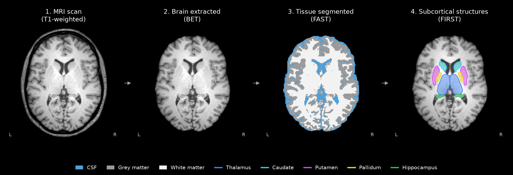
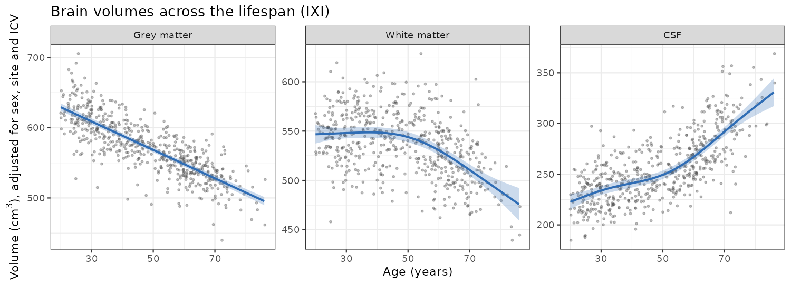
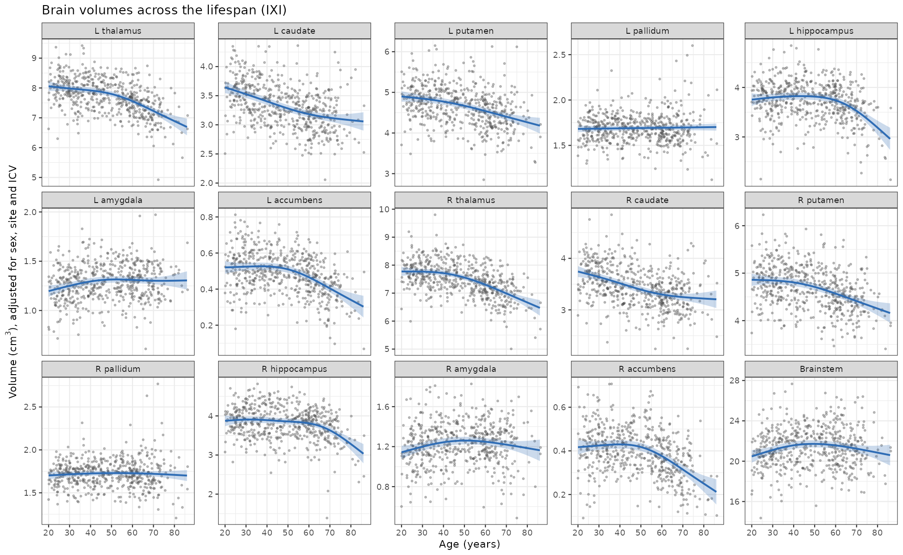
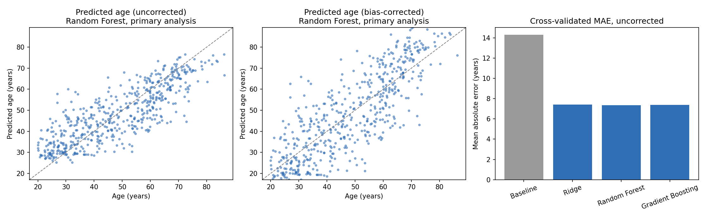
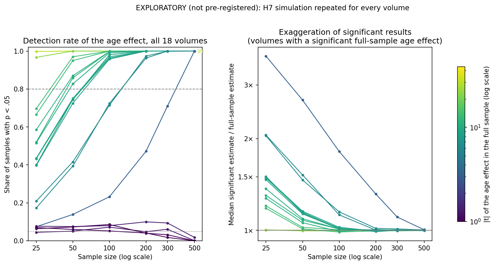
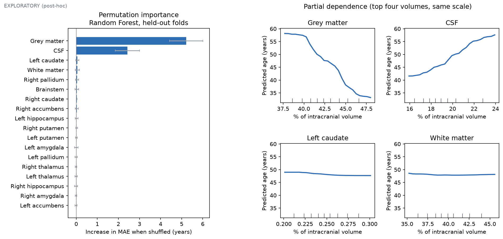
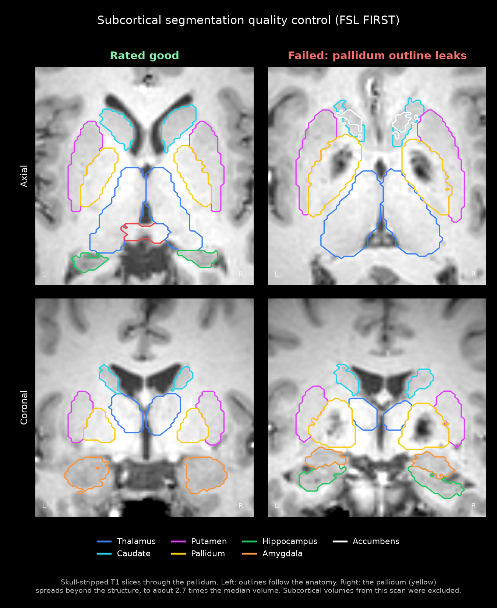

# Brain Changes Across the Lifespan: Estimating Age from MRI (Plain-Language Version)

*This is an easier-to-read version of the project summary. The full version, with plain-language summaries and all technical detail, is [README.md](README.md), and the original study plan is [PREREGISTRATION.md](PREREGISTRATION.md) (plain-language version: [PREREGISTRATION_PLAIN_LANGUAGE.md](PREREGISTRATION_PLAIN_LANGUAGE.md)).*

## What this project asked

1. **How does the brain change as adults get older?** How much do grey matter, white matter, cerebrospinal fluid (CSF) and deep-brain structures shrink or grow between age 20 and 86?
2. **Can a machine learning model accurately predict someone's age from a brain scan?** If so, does it still work on scans from a hospital it has never seen?
3. **Do small studies produce misleading results?** If a study only had 25 participants, how often would it find these age effects, and how accurate would its estimates be?

To answer these, I analysed 563 publicly available brain MRI scans of healthy adults from three London hospitals.

## Glossary

| Term | Meaning |
| --- | --- |
| MRI | A scanner that uses magnetic fields to take detailed pictures of the body, without radiation |
| Grey matter | Brain tissue where information is processed |
| White matter | Nerve fibres that carry signals between brain regions |
| Cerebrospinal fluid (CSF) | The fluid in and around the brain |
| Deep-brain (subcortical) structures | Groups of brain cells deep inside the brain, such as the hippocampus (memory), amygdala (emotion) and thalamus (sensory relay) |
| Pre-registration | Writing down predictions and methods before seeing the results |
| Blind | Done without knowing information (like age) that could bias the decision |
| Benchmark (baseline) | A simple "no-skill" prediction that a real model has to beat |
| Average error (MAE) | How far off a prediction is, on average, in years |
| Winner's curse | Small studies that find an effect tend to overestimate it |

## The main findings

- **The brain gradually loses volume with age.** Grey matter (the brain's "processing" tissue) shrank steadily, by about 3.5% every ten years. White matter (the "wiring" between regions) held steady until the late 30s, then declined, especially after 60. CSF grew to fill the gap, about twice as fast after 60.
- **The hippocampus, a structure central to memory, stayed stable until about 60**, then shrank by about 8% per decade.
- **A computer model estimated participants' ages from their brain measurements to within 7.4 years on average.** That is half the error of simply using the average age for everyone. It worked just as well on scans from a hospital it had never been trained on.
- **Small studies can be misleading.** With only 25 participants, a real correlation between age and hippocampus size would be found in about 20% of the sample, and when it was found, its size would be exaggerated about twofold.

## How the study was done

| Step | What happened |
| --- | --- |
| 1. Get the data | Downloaded brain scans and ages from the free IXI dataset (563 adults, ages 20–86, three London hospitals). |
| 2. Measure the brain | Used FSL, standard brain-imaging software, to remove the skull from each image, label grey matter, white matter and CSF, and outline 15 deep-brain structures. Each was then measured in cubic centimetres (cm³). |
| 3. Write the plan first | Before looking at any results, I wrote down seven predictions and exactly how I would test them (a **pre-registration**). This stops results from being "fished for" afterwards. |
| 4. Check quality, blind | I looked at every scan's measurements to catch software errors. Scans were shown under random codes, so I couldn't know anyone's age, sex or hospital while judging them. |
| 5. Test the code on scrambled data | All analysis code was written and tested on a copy of the data where ages were shuffled between participants, so no real result could influence how the code was written. |
| 6. Run the real analysis | Fitted smooth "lifespan curves" for each brain measure, trained age-prediction models, and ran a simulation of small studies. |

*The same slice of one brain scan at each step: the original scan, the skull removed, the brain labelled as CSF (blue), grey matter and white matter, and the deep-brain structures outlined in colour.*

Each step is a script in the `scripts/` folder; the technical README lists them all.

## The seven predictions and what happened

| | Prediction | Result |
| --- | --- | --- |
| H1 | Grey matter shrinks with age | ✅ Confirmed |
| H2 | White matter grows into midlife, then shrinks | ✅ Confirmed |
| H3 | CSF increases, faster after 60 | ✅ Confirmed |
| H4 | The hippocampus and thalamus shrink, faster after 60 | ✅ Confirmed |
| H5 | A computer model can estimate age better than simply using the average age | ✅ Confirmed |
| H6 | The model works worse on a hospital it wasn't trained on | ❌ Not confirmed (it worked just as well) |
| H7 | Small studies find the grey matter–age effect less often and exaggerate it | ⚠️ Technically met, but not informative (explained below) |

Every result stayed the same when I re-ran the analysis in different reasonable ways, for example with stricter quality checks, without one of the hospitals, or without correcting for scanner differences.

## How the brain changes with age (H1–H4)

*Each dot is one participant; the blue line is the average trend, and the shaded band shows how certain that trend is. Volumes are adjusted so that differences in sex, hospital and head size don't distort the picture.*

- **Grey matter:** Lost about 20 cm³ (3.5%) every decade, in an almost straight line, about 134 cm³ in total from age 20 to 86.
- **White matter:** Peaked around age 37, then declined, slowly at first and about five times faster after 60.
- **CSF:** Rose throughout adulthood, roughly twice as fast after 60.
- **Hippocampus:** Stable until about 60, then lost about 8% per decade on each side.
- **Thalamus:** Shrank throughout adulthood, faster after 60.

Other deep-brain structures involved in movement and reward (caudate, putamen, accumbens) also shrank with age. One structure, the **pallidum**, showed no change, but the software is known to measure it least reliably, so that result should be treated with caution.

## Estimating age from a brain scan (H5–H6)

*Left and middle: Each dot is one participant, comparing their predicted age with their real age; a perfect prediction would sit on the dashed line. Right: The average error of each model.*

| Method | Average error |
| --- | --- |
| Use the average age for everyone (the benchmark) | 14.3 years |
| Ridge regression | 7.4 years |
| **Random forest** (best) | **7.4 years** |
| Gradient boosting | 7.4 years |

- **All three computer models halved the benchmark's error.** They performed almost identically, which suggests the useful information is in the brain measurements themselves, not in the choice of model.
- **The model worked on unfamiliar hospitals.** When trained on two hospitals and tested on the third, it was about as accurate as when trained and tested within the same hospital. One caveat: The two tests used different amounts of training data, so this comparison isn't perfectly clean.
- For context, published models that use the full detail of brain images reach about 3–5 years of error. This model used only 18 simple measurements.

**Extra findings (not part of the original predictions):**

- **Men's brains looked about 5 years "older" than women's.** However, part of this is a side effect of the method. The model adjusts each measurement for head size, men's heads are larger on average, and brain parts don't scale exactly with head size. After accounting for this, the difference dropped to about 3 years. It shouldn't be read as men's brains ageing faster.
- **Lower-quality scans made brains look older**, which is why image quality was recorded for every scan.
- **The model underestimated the ages of the oldest participants** (over 80, by about 11 years), a known weakness of these models, though only 8 participants were in that age group.

## Do small studies mislead? (H7)

**The planned test didn't tell us much.** The link between age and grey matter is so strong that even studies of 25 participants found it 99.8% of the time, so there was no room to show that small studies struggle.

**I therefore repeated the simulation for all 18 brain measures**, including ones with much weaker age effects. To avoid cherry-picking, I ran it on every measure rather than choosing one that would make a good story.

*Left: How often a study of each size finds an age effect. Right: How much the studies that did find one overestimated it (1× = accurate). Each line is one brain measure; lighter lines have stronger age effects.*

| Brain measure | Strength of age effect | Found by studies of 25 participants | Found by studies of 100 | How much studies of 25 overestimate it |
| --- | --- | --- | --- | --- |
| Grey matter | Very strong | 100% | 100% | Accurate |
| Thalamus | Strong | 70% | 100% | 1.2× |
| Putamen | Moderate | 40% | 96% | 1.5× |
| Hippocampus | Weaker | 21% | 72% | 2× |
| Amygdala | Weak | 7% | 23% | 3.7× |

The weaker the real effect, the more often small studies miss it, and the more they exaggerate it when they do find it. This is known as the **"winner's curse"**.

## Extra checks added afterwards

These checks were added after the main results were known, so they weren't part of the original plan and are reported separately.

- **Other models, including a neural network, performed the same.** Six different methods all estimated age to within about 7.3–7.7 years. That suggests the limit is the information in the 18 brain measurements, not the choice of method.
- **The model relied mainly on two measurements.** Grey matter (less grey matter = older) and CSF (more CSF = older) did almost all the work; the deep-brain structures added very little on top.
- **More scans of the same kind wouldn't help much.** Accuracy improved as the model was given more scans, but levelled off at around 240. Better measurements, such as cortical thickness, would likely help more than more participants.
- **Automatic outlier detection caught some errors but not others.** Given no information about the quality ratings, it picked out most of the deep-brain outlining errors, but none of the whole-brain errors, which can only be seen by looking at the images. That supports checking every scan by eye.

*Left: How much worse the model gets when each measurement is scrambled; longer bars matter more. Right: How the model's predicted age changes with the two measurements it relies on most: less grey matter and more CSF both mean an older predicted age.*

## Checking the quality of the measurements

Brain-imaging software sometimes makes mistakes, such as outlining the wrong area. Every scan was checked by eye and rated **good (0), minor issue (1) or failed (2)**.

- **Consistency check:** 50 scans were rated a second time. Decisions about whether a scan failed matched 96–98% of the time. Telling "good" from "minor issue" was less consistent, but both are kept in the analysis, so it doesn't affect the main results.
- **Visual checks caught what automatic checks missed:** 14 of the 18 failed scans had passed the software's automatic warnings.
- **Unusual measurements were double-checked:** 11 scans with extreme measurements were redrawn and reviewed. 7 were confirmed software errors and 4 were left in, because the outlines matched the real anatomy (an unusual size alone isn't an error).

*Left: A scan where the software outlined each deep-brain structure correctly. Right: One of the confirmed errors; the outline of the pallidum (yellow) spills well beyond the real structure. This scan's deep-brain measurements were removed, but its whole-brain measurements were kept.*

| Hospital | Scans | Removed completely | Kept | Kept, but deep-brain measurements removed |
| --- | --- | --- | --- | --- |
| Guy's | 314 | 12 | 302 | 5 |
| Hammersmith | 181 | 6 | 175 | 6 |
| Institute of Psychiatry | 68 | 0 | 68 | 2 |
| **Total** | **563** | **18 (3.2%)** | **545** | **13** |

Scans "removed completely" had a failed whole-brain measurement. Scans with only their deep-brain measurements removed were still used for the whole-brain analyses.

## Changes from the original plan

A pre-registration is only trustworthy if any changes to the plan are reported openly. There were **eight**, all listed in full in the technical README. In short:

- **Seven** were made while testing the code on scrambled data, before any real results were seen: For example, correcting a typo in the hospital counts, writing out the exact pass/fail rules for each prediction, and fixing a rule for H6 that could "pass" even with meaningless data.
- **One** was a scheduling change: The second round of quality ratings was done 2 days after the first instead of the planned week, which may make the ratings look slightly more consistent than they are.

## Data and author

Data: [IXI dataset](https://brain-development.org/ixi-dataset/), free to use under a CC BY-SA 3.0 licence. Brain scans are not stored in this repository but can be downloaded from the IXI website.

Michael Goldenitz · [LinkedIn](https://www.linkedin.com/in/michael-goldenitz-790509265/)
